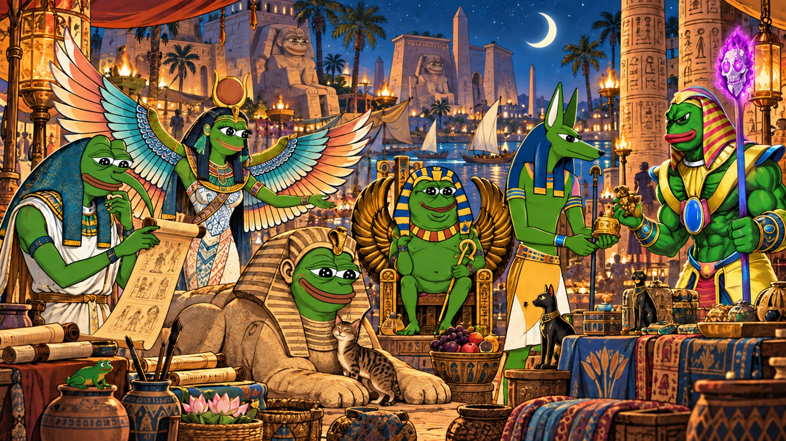

# VORTEX · The Nile of Rare Frogs

An Egyptian frog adventure with a Rare Pepe heart, open to every Counterparty asset. Consult a questionable ibis, negotiate with a crocodile, tune the solar boat, and carry a mark of your own through ten temples and twenty-two streams.



## Play locally

Use Node.js 22.18 or later (Node 22 LTS recommended).

```sh
npm ci
npm run dev
```

Open the local address printed by Vite. Choose a name and answer six short questions. No account, wallet, API key, Python environment, or paid service is needed.

For a production build:

```sh
npm run build
npm run preview
```

Alternatively, after building, Python 3.11+ can serve the game without third-party packages:

```sh
python3 run_game.py --open
```

## The walk

- **Walk** along a connected stream. A first crossing reveals its name; a return reveals its meaning.
- **Look** to uncover each temple's details, rite, and original Rare Pepe artwork.
- **Sit** to clear shared darkness. The first rest at each temple strengthens your pillars.
- **Perform a rite** and choose how your frog responds to a small, strange problem.
- Bring Mercy and Severity to 25% each at Vibe Temple to reveal Crown. Look at Boundaries to reveal Qoph.
- At Meme Studio, complete the rite and write a sigil. Visit six temples and complete four rites, then **Root** your journey at Kingdom.
- **Follow a story.** After a temple rite, its Rare Pepe has an errand for you. Carry it to another temple, complete that local rite, make the delivery, then return and decide what changes. Carry up to three unfinished stories.
- **Arrange the solar crossing.** PEPEPHARAON's errand now has passenger clues and two small sailings. A kindness at Mercy can bring help from the cook; you can also let the sphinx handle the crossing. Earlier choices leave visible props at the tablet desk, courtyard and Kingdom gathering.
- **Celebrate Chapter II.** Bring three stories home and reveal four streams, then return to Kingdom for a Nile festival. Choose the long table, the river of lanterns, or the unfinished chorus. The guests remember your choices.
- The **next-step guide** above the scene suggests a useful action or one legal crossing. Select a story in **Stories** to follow its route; you remain free to explore.

The Living Atlas edition (0.6) adds a connected mythology notebook and two new encounters to the ten branching token-specific stories, persistent return scenes, three festival endings, ten distinct rites, classical and folk voices, stream Codex and open Counterparty archive. Up to twelve independent seekers share one local tree. The Watcher changes the water silently; each seeker's rites and Harmony remain their own.

## The Living Atlas

Explore **45 entries and 51 connections** across Egyptian and Sumerian figures, six tarot lenses, six narrative archetypes, contextualized Maya material, a small Dogon reading room, Bitcoin Stamps and real Counterparty assets. Search aliases, filter by tradition or theme, compare three entries, inspect the evidence behind a connection and remember it in your seeker's notebook. Source accounts, disputed accounts and VORTEX interpretations have separate labels.

Bring those ideas back into the game. At **Hod**, help a scribe with **The Disputed Tablet**: preserve both accounts, seek a witness at Yesod or publish a provisional reading. At **Netzach**, try **The Gate That Remembers**: negotiate, cooperate or ask a friend whose help you have earned. Follow buttons suggest legal steps through the existing map. Your choices change later scenes and Kingdom's gathering, and survive reloads and journal rollover.

These are new frog stories informed by contextualized reading. Cultural traditions retain their differences; the atlas does not claim a shared historical origin. Broader Maya and Dogon adaptations still need specialist review. See [the implementation and editorial record](docs/LIVING_ATLAS.md).

## Real Rare Pepes, honest provenance

The archive uses **THOTHPEPE, GODDESSISIS, GODANUBIS, SPHINXPEPE, PEPEPHARAON, LORDKEK, KEKET, RAREPEPE, ZAZENPEPE, and PEPEZENMSTR**. Their asset IDs, issuance blocks, divisibility, and supply snapshots were checked against the Counterparty mainnet API. The original images are preserved, and every card links to its token record.

The new temple scene and character portraits are interpretations of those existing artworks. VORTEX does not invent or issue Rare Pepe tokens. Finding a card in the game records a discovery; it does not transfer ownership. See [art provenance](docs/ART_PROVENANCE.md) and the [verified records](docs/references/counterparty-assets.json).

## The address ledger

At **Kingdom**, open **The address ledger** and enter a public Bitcoin mainnet address. Pressing **Look up** sends only that address to the official Counterparty API. No wallet connection, signature or payment is required. **All Counterparty assets** is the default, including named tokens, numeric assets and subassets. Search by name or identifier on the device; **Rare Pepe characters** is an optional filter. Asset and address links use **xcp.io**. Matching artwork can lead you back to a character's story without awarding any progress.

The ledger adds address and attached-output quantities using exact integer arithmetic. It follows pagination, checks node readiness before and after loading, rejects incomplete or inconsistent results, and has request, response-size and page limits. Missing divisibility is displayed as unscaled raw units. Errors never become zero balances. The reported data excludes BTC, escrow, SRC-20 balances and unconfirmed changes, can be cached by the public service, and is not a proof of ownership or an atomic block snapshot.

Addresses and results stay in memory only. Editing the address cancels the previous lookup; closing the ledger, leaving the page or changing seekers clears it. They are excluded from saves, exports, journals and the browser-agent tools. The ordinary game still works offline. See [the API adapter contract and evidence](docs/COUNTERPARTY_LEDGER.md).

## The enduring mark

After Looking at **Hod, Yesod or Malkhut**, enter the **Chamber of the Enduring Mark**. Three linked readings carry the game’s making → foundation → public-record correspondence into Bitcoin Stamps, immutable data and the KEVIN Stamp Saga. Each reading has a guide’s voice, a sourced factual passage and an optional reflection. The chamber is also available in the Asset archive. It works offline; external sources require a connection.

The archive can prepare an **xcp.io** link for any named or numeric Counterparty asset, including case-sensitive subassets. No lookup occurs until you follow the link. Its existence is checked by the explorer; typing a name does not add an invented asset to the game.

Classic Stamps and SRC-20 are distinguished in the teaching and ledger. The game creates no chain records. See [research, sources and fictional correspondences](docs/BITCOIN_STAMPS.md).

## Your saves and optional wallet witness

Journeys are saved in this browser, in the existing `vortex-world-v3` storage slot with a version-5 payload. Released version-3 and version-4 saves load automatically, preserving the original journey; the next successful action saves the upgraded format. Earlier clients reject the new format instead of discarding its history. Export from **Journeys** before clearing browser data or moving devices. Imports validate the file and merge new seekers; conflicting histories require an explicit choice.

Each successful replacement of a valid save keeps its previous version as a recovery copy. **Journeys** can download or explicitly restore that copy, preserving the replaced original. Restore rejects changes made since confirmation and cannot downgrade an unknown future format. Web Locks coordinate writes across tabs; browsers without that capability allow reading and export only. Unreadable saves remain downloadable, and unrelated older `vortex-save-v1` files are not automatically migrated.

The production build caches the game and its artwork for return visits offline after the first successful load. An available update waits until you choose **Update and return** or close the older tabs. Clearing site data removes both saves and offline files. Private hosting may still require an online sign-in. Exporting remains the portable backup.

A wallet is optional. At Kingdom, a completed seeker may sign a ten-minute, seeker-specific message in their own wallet and paste back its signature. Verification happens locally. Supported proofs are BIP-322 simple for native SegWit and Taproot key paths, and legacy message signatures for P2PKH. Multisig, script paths, full transactions, and PSBTs are excluded. No keys, seed phrases, payments, minting or transactions are part of this release. The separate address ledger makes read-only balance queries only after an explicit lookup.

Guide replies are authored and selected by context. Questions are neither retained nor sent to an AI service. Local saves are not encrypted, and local achievements are not external credentials.

## Development and checks

```sh
npm run check:lattice  # generated browser data matches the Python canon
npm run check          # game, interface, save and signature tests; typecheck; build
python3 -m pip install '.[test]'
python3 -m pytest      # maintained Python kernel and launcher regressions
```

The automated game walk covers both chapters from all **729** questionnaire combinations, all 90 outward/return story-choice combinations, all nine atlas encounter pairs, all three festival endings, and a 3,000-turn randomized walk. Actual released v3/v4 fixtures check migration. Tests cover recovery failures, source integrity, emulated interface journeys and typed browser-agent actions; signature tests include Bitcoin's published BIP-322 vectors. Native in-app Chromium checks also exercised the atlas, consequential choices, reload, recovery, two-tab conflicts and small-screen reflow. These checks do not replace broader browser, assistive-technology or cultural review. GitHub Actions runs the maintained checks on pushes and pull requests.

- [Architecture and maintenance](docs/architecture.md)
- [Improvement plan and release status](docs/ROADMAP.md)
- [Game review, UI fixes and completion priorities](docs/GAME_REVIEW_2026-09-12.md)
- [Gameplay improvements and verification](docs/GAMEPLAY_PASS_2026-09-12.md)
- [Five-player playtest worksheet](docs/PLAYTEST_WORKSHEET.md)
- [Living Atlas sources, encounters and verification](docs/LIVING_ATLAS.md)
- [The lattice doctrine](docs/doctrine/THE_LATTICE.md)
- [Session doctrine](docs/doctrine/PLAY.md)
- [Original development backlog](docs/doctrine/NEXT.md)
- [Legacy Python experiments](docs/LEGACY.md)

The tree is still ten offices and twenty-two streams. The new Egyptian story and token associations are fiction, not spiritual instruction or claims of utility from the original artists.
