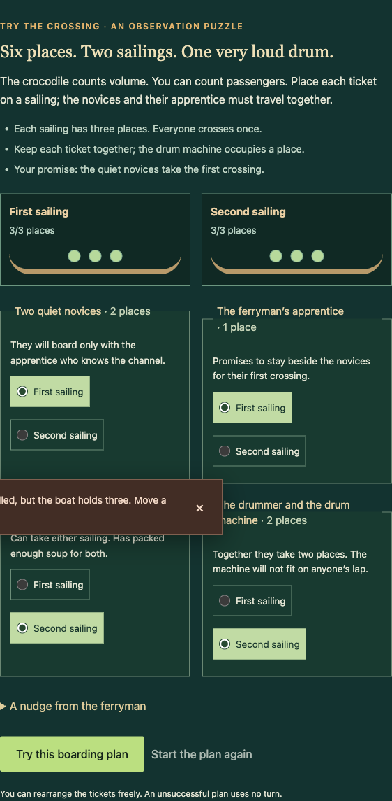
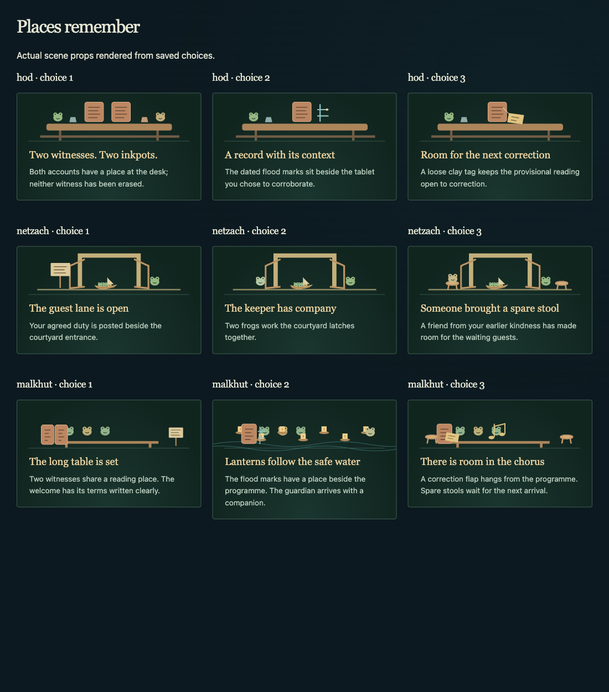

# A crossing with consequences

This implements the next bounded step from the [game review](GAME_REVIEW_2026-09-12.md): a more involved errand, visible consequences, and a single route guide. The changes are local and have not been deployed. The ten temples, twenty-two streams, chapter requirements and save schema 5 remain compatible.

## Play the new crossing

Complete Vibe Temple's rite, take **PEPEPHARAON's “The solar boat's difficult encore”** story, and carry it to Boundaries. After the local rite, the delivery becomes a boarding puzzle. Four passenger tickets occupy six places across two sailings. The novices must stay beside their apprentice; the drummer's machine occupies a place. Choosing the quiet crossing earlier also promises the novices the first sailing.

Ticket radios work with the keyboard and update the boat counts. An invalid plan gives a specific explanation and changes no turn, revision or reward. A completed Mercy errand brings the cook back with a suggested arrangement. Asking for that help only fills the tickets; the player still submits. A plain-language hint is available without that friendship. **Let the sphinx arrange the crossing** continues the original delivery directly, with the same story completion and return choices.

The arrangement is an unsaved draft. It survives ordinary view/dialog changes, then clears when leaving the location, completing delivery, switching seekers, restoring a journey or reloading. Solving adds a journal response; delivery remains the existing saved boolean. The game does not permanently distinguish assisted, delegated and independently solved crossings.

## See earlier decisions in the world

Small original SVG illustrations accompany the existing temple scene after Look:

- **Hod:** two witnesses and inkpots, dated flood marks, or a provisional correction tag follow the tablet decision.
- **Netzach:** a closed courtyard opens with posted terms, a second frog at the latches, or a friend's spare stools. The solar errand adds a boat to the shore.
- **Kingdom:** returning stories bring guests. The long table, lanterns and chorus have distinct arrangements, with props carried forward from the tablet and gate decisions.
- **Vibe Temple:** the completed delivery leaves two boats at the shore.

These drawings and their text alternatives derive from existing progress, independently of the bounded journal. They also appear for journeys completed before this update. They are fictional scene props, not new token art or historical diagrams.

## Follow one route and keep a reading place

The compass owns the route. Following an Atlas encounter replaces a tracked story; selecting a story replaces the encounter. The route respects veils and darkness, offers Look and the local rite when needed, then opens the encounter. A resolved Yesod encounter remains readable. The browser-agent state uses the same route priority as the visible guide.

Navigation stays visible while reading. Its mobile header is compact, and focus targets account for its measured height. Returning to a view restores scroll position and open notes for that seeker during the current session. Explicit entry links still take the player to the requested article. Changing seekers or restoring a save clears the old reading place.

## Verification

- **62 browser/game tests passed**, including seven new tests for this increment. The existing complete-journey coverage still includes all 729 questionnaire placements, 90 story branch pairs and nine encounter pairs.
- Every one of the **48 possible boarding arrangements** across three outward choices is accepted or rejected according to capacity, companionship and the quiet-first promise. Malformed, wrong-location, wrong-story and duplicate delivery attempts cannot award progress. Both assisted and delegated deliveries still resolve normally.
- Emulated interface coverage checks invalid-plan atomicity, help/reset controls, seeker draft isolation, a single compass, reading bookmarks and open notes.
- Native Chromium exercised invalid and corrected submissions, keyboard focus retention, Atlas/story route replacement and reload. An open Atlas connection returned at exactly the recorded scroll position (1152.5px). Puzzle reflow at 320, 390, 768, 1024 and 1440px produced no horizontal overflow or duplicate IDs.
- After compacting the sticky mobile header, all six main views were checked again at those five widths: **30 view/width combinations**, with no page overflow, duplicate IDs, failed completed image loads or page errors. The header occupies 117.5px at 320/390px widths; it remains reachable while reading.
- An isolated Chromium context loaded the production service worker, went offline, reloaded the puzzle, asked the cook for help, completed delivery and reloaded the saved result. No page errors occurred. This used a test journey, not a player's save.
- All nine tablet/gate/festival illustration variants were rendered for visual inspection. The fixture tests also verify journal rollover and later returns.
- A genuine save generated using released commit `519098ab539df09c10c918149662ab7d7c5de7b4` is preserved as [living-v5.json](../vortex/web/tests/fixtures/living-v5.json). The current parser reads it without changing any field. Separately, the archived released parser read a newly solved boarding save exactly. See [fixture provenance](../vortex/web/tests/fixtures/README.md).
- TypeScript, production build, generated offline-worker checks, canonical graph validation, **22 maintained Python tests**, formatting and whitespace checks passed.

## Next acceptance work

Use the [five-player session worksheet](PLAYTEST_WORKSHEET.md) to assess whether players notice the consequences and find the crossing satisfying. No human observations have been collected in this pass. Assistive-technology sessions, actual Safari/Firefox/Android journeys, interrupted writes, an update with an old client still open, deployed headers and rollback remain release-evidence tasks.

Do not expand the number of puzzles or culture packs until those sessions reveal what improves pacing. Broad Maya/Dogon adaptation still needs specialist review. The larger original AI, minting and online-world ideas remain deferred in the current roadmap.
