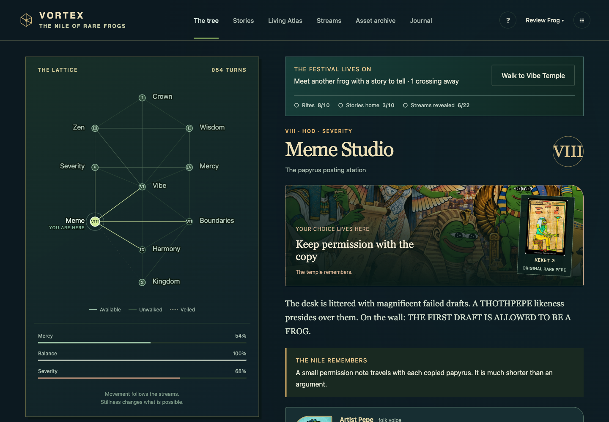

# VORTEX game review · 12 September 2026

**Verdict: VORTEX has a complete, playable two-chapter core. Its next gains should come from clearer choices, stronger consequences, and release verification.** The original plans describe several different generations of the project; treating every historical checkbox as a release requirement would make completion impossible to assess.

This review covers the maintained browser game, its generated Python canon, saves, content, UI, tests and production build. The changes below are implemented and verified locally, pending release. They preserve save schema 5, the ten offices and twenty-two streams, existing endings, and optional wallet use.

## What is working

- **A distinctive setting and voice.** The ibis arguing with a footnote, soup kitchen, candle-eating guest and solar boat are memorable situations. The Egyptian frog world, original cards and informal guide voices give this a recognizable identity.
- **A coherent, bounded game.** One graph supports discovery, return journeys, rites, Harmony, Qoph and two endings. The correspondence system does useful work without requiring additional maps.
- **Real narrative memory.** Ten errands have outward choices, deliveries and return decisions. Two Atlas encounters produce later scenes. These consequences persist independently of the short journal.
- **A welcoming technical foundation.** A newcomer can play without an account, wallet, model service or payment. Static delivery and offline play suit the game. Token discovery, ownership and authored fiction are distinguished.
- **Unusually strong regression coverage for this size of project.** The reducer, save validation, migrations, recovery, signatures and complete journeys already had substantial tests. Fixes can build on this foundation.

## Bugs and friction addressed

| Priority | Reproduction / effect before this pass | Local correction |
| --- | --- | --- |
| P1 | Type a sigil or question as one seeker, then switch seekers. Shared UI drafts could appear in the second journey; submitting a stale sigil could replace its mark and clear its completion/witness. Encounter tracking also followed the wrong seeker. | Clear drafts, Atlas view state and tracking when the active identity changes. Explicit recovery also clears stale drafts. |
| P2 | Search the Atlas for a nonexistent name, or open an empty notebook. The index reported no matches while an unrelated article and its connections remained visible. | The detail must belong to the filtered result set. Empty results get an explicit empty state. Following an external entry link clears incompatible filters. |
| P2 | Open the three Atlas theme entries. The view stopped at twelve connections: Memory has 13, Return 19 and Threshold 14. Ten explanation positions were inaccessible. | Expand/collapse controls expose every published relationship and its evidence. |
| P2 | Type a name and choose Classical, then open Help before submitting the gate. A rerender lost those choices. | Preserve unsaved onboarding values across ordinary dialog rerenders. |
| P2 | Use the keyboard to open the first question or press Perform a rite. Focus could remain behind the newly shown choices or fall back to the document. | Focus the new question, rite panel and changed view. |
| P2 | Visit completed encounters or return to a changed temple. The same aftermath could appear in the scene, encounter card and latest-action panel. | Keep the persistent scene response once; details record the decision and later destination. Standalone story rendering and the Stories ledger retain their aftermath. |
| P2 | Stay in an office until its guide entry rolls out of the journal. A Folk journey could fall back to Classical text. | Use the same dialect-aware voice selector as the reducer. |
| P2 | View exit cards before crossing their streams. They already exposed letter names, weakening the first-crossing discovery rule. | Unwalked exits remain unnamed; destination and travel availability stay visible. |
| P2 | Open any main view at 768px, or Stories/Asset archive at 320px. Header controls or heading statistics extended beyond the page. | Reflow the tablet navigation and stack narrow collection headings. |
| P2 | Hover a choice in a dark story/encounter panel. A global style intended for the light rite card made its text dark green. | Scope that dark hover color to the light rite card. |
| P2 | Publish a change only to HTML or another file whose name stays constant. The offline cache fingerprint used bundle names, so it could fail to signal an update. | Hash every cached filename and its contents, including HTML; public-file renames and image changes participate too. |

Relevant implementation: [interface](../vortex/web/main.ts), [Atlas view](../vortex/web/atlas-view.ts), [story view](../vortex/web/story-view.ts), [offline cache identity](../tools/offline-cache.ts), and the [new regressions](../vortex/web/tests/review.test.ts).

## UI and game-feel improvements implemented

The next-action card now includes chapter requirements: sigil, temples and rites before Rooted; stories and revealed streams before the festival; optional exploration totals afterwards. These counts describe actual progress and make no new rewards or completion rules.

Each temple now reframes the existing world illustration, uses a local accent and displays its own original card after Look. Its inscription changes to the player's actual rite, story or encounter decision. This adds visible identity and memory without commissioning ten new backgrounds or modifying original token art.

Rite choices and immediate feedback now come before optional stories and readings. The tablet and gate are clearly labeled optional encounters with expandable details. The repeat artwork block was removed from the bottom of the play screen, along with its unused CSS. Original artwork remains inspectable from the scene, stories and archive.

## Duplicate and maintenance audit

- The Atlas contains **45 unique entry IDs and 51 unique relationship IDs/pairs**. No duplicate relationship pairs were found. Tests now check pair identity as well as individual IDs.
- Existing tests validate the ten asset records, ten story definitions and generated 10-office/22-stream graph. The maintained data sources are deliberately reused across views; repeated references are not duplicate rewards.
- A hash scan of tracked code/data files over 100 bytes found two exact duplicate file pairs: `vortex-next/src/core/ai/mcp_transport.py` and `retry.py` match the corresponding files under `vortex/src/core/ai/`. These belong to the documented legacy experiments. They are not imported by the shipped browser game. Preserve or archive them deliberately; deleting one copy during a UI review could break historical users.
- The starting stylesheet had **57 repeated selector groups in the same media context**, but no repeated properties inside an individual rule. Much of this is the older theme plus later overrides. Removed obsolete scene/card rules in this pass; a scoped theme consolidation remains worthwhile.
- `main.ts` still combines rendering, dialog state, browser storage and event routing. The new scene/progress presentation has its own small module, but a complete render/event rewrite would require a separate migration and focused browser evidence.
- Older planning documents now point readers to the current roadmap. They remain historical records rather than competing completion checklists.

## How close is it to the original plan?

| Original intent | Current state | Completion decision |
| --- | --- | --- |
| Questionnaire, zones, guides and progression | Six authored placement questions, ten offices, ten rites and guide voices are playable. | Core delivered. Do not describe the questionnaire as validated psychological analysis. |
| One cosmology the player can walk | Canonical 22-stream map, return meanings, Crown/Harmony and Qoph. | Delivered; keep the graph stable. |
| A name on the floor of the world | Wallet-free Rooted ending plus optional verified address witness at Kingdom. | Delivered under the current hospitality-first scope. |
| Several seekers on one tree | Up to twelve local seekers, individual history and shared darkness. | Delivered locally. Online multiplayer remains a different project. |
| A silent director | A deterministic haste rule darkens a stream while leaving an exit. | Partial relative to earlier doctrine: model-driven direction, pillar-tilt/thin-presence rules are not all implemented in the browser. Do not claim them as delivered. Decide whether extra rules improve observed play before adding them. |
| Mythological integration | Sourced/qualified Atlas entries, relationships and two connected encounters. | Pilot delivered. Broad cultural packs and specialist review remain open. |
| Dynamic AI, adaptive challenges, emotional modeling | Current replies are authored/contextual; progression is deterministic. | Deferred scope, not release blockers. Better authored memory should come first. |
| Hod writing to a chain | Local sigil, Stamps readings, public asset references and optional address lookup. | Chain minting is deferred. The game does not publish a sigil or transfer a token. |
| Finish or freeze the CLI | The supported Python entry serves the browser build. Older simulation/AI engines are quarantined. | Decision delivered; avoid reviving a second game state model accidentally. |
| Polish, stability and playtesting | Strong automated checks; this pass adds UI fixes and native evidence. | Human play, accessibility and broader browser evidence still gate a more confident release. |

References: [2024 goals](planning/GOALS.md), [session doctrine](doctrine/PLAY.md), [earlier lattice backlog](doctrine/NEXT.md), [current forward plan](NEXT_PHASE_PLAN.md), [current roadmap](ROADMAP.md), [legacy boundary](LEGACY.md).

## What should improve next, in order

1. **Observe five newcomers.** Can at least four make a meaningful choice within three minutes and explain their next objective without coaching? Do they understand Look, rite, story and Atlas as different activities? Record where they hesitate; do not infer enjoyment from successful automated walks.
2. **Make a few consequences materially visible.** Add a changed prop, doorway, table setting or character reaction at two or three return scenes. Let an earlier kindness open a later dialogue/puzzle approach. Preserve an accessible alternative route. The current choice inscription is a first step; most rite choices still award identical pillar gains, and most errands share the same delivery/return structure.
3. **Vary one existing errand before expanding the content count.** Prototype a small observation, sequencing or cooperative puzzle within the same map. Test whether it feels more involving than choosing among three prose answers. Avoid adding a new room or resource system just to create complexity.
4. **Finish the release evidence.** Test VoiceOver/NVDA and actual Safari, Firefox and Android journeys; interrupt writes; test an update with an older release still open in another tab; inspect hosting headers and rollback behavior. Preserve genuine v5 fixtures before the next save-format change.
5. **Consolidate the presentation layer.** Centralize theme variables, remove superseded overrides, keep one route priority in the compass, and preserve reading position when returning from the Atlas. Improve map status cues for completed rites and available errands without spoiling undiscovered streams.
6. **Expand one reviewed culture pack at a time.** Use a small Sumerian encounter as the next candidate, consistent with the forward plan. Broader Maya/Dogon material still needs specialist review. Every new relationship should have a source or explicit fictional classification and a useful role in play.

Live AI, trading, minting, online multiplayer and hundreds of extra entries are lower priorities than these checks. They add dependencies and new product decisions without resolving the main remaining weaknesses in pacing and consequence clarity.

## Verification and limits

- **55 browser/game tests passed**, including the existing 729 questionnaire placements through both chapters, 90 story branch pairs, nine Atlas encounter pairs, all festival endings, migrations/recovery and signature vectors. Five new tests cover this pass's Atlas, UI, presentation-state and offline-cache regressions.
- **22 maintained Python tests passed** using the existing Python 3.11 review environment. The default shell's Python lacks pytest; that was an environment difference, not a game failure. The wider legacy suite was not claimed or run.
- Canonical graph check, TypeScript, production build, generated offline-worker checks and `git diff --check` passed.
- A native Chromium UI walk created a separate Review Frog, completed Chapter I, brought three stories home and chose the lantern festival at turn 53. Reload preserved the result. Atlas expansion exposed all 19 Return connections; no-result search and cross-entry navigation worked.
- Native reflow checks covered all six main views at **320, 390, 760, 768, 820, 1024, 1100 and 1440px**: 48 combinations with no horizontal page overflow after the fixes. An earlier 24-combination pass also checked duplicate DOM IDs and failed completed image loads; none were found.
- A separate, isolated Chromium context loaded the production build and its service worker, then went offline. It could reload, create a seeker, Look, save and reload that progress. The production document's CSP and all four landing images were present.
- `npm audit` reported **0 known advisories** on 12 September 2026. This is a dependency advisory check, not a security certification.

These checks do not establish human accessibility, cultural accuracy, enjoyment, effective deployed headers, universal wallet compatibility or an old-client update/rollback guarantee. No production deployment, external messaging, wallet signing or real balance lookup was performed during this pass.
