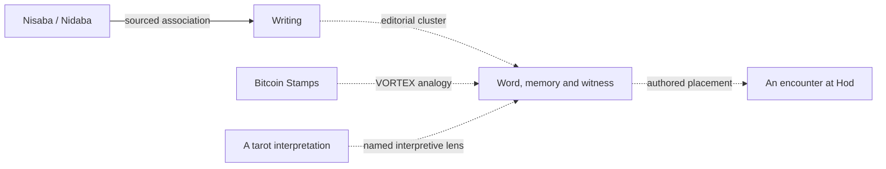

# VORTEX: hardening, the Living Atlas, and a larger mythic world

**Decision report · 12 September 2026**  
**Reviewed baseline:** Enduring Mark 0.5.0, GitHub main at [`fe3e6ce`](https://github.com/arwyn6969/vortex/commit/fe3e6ce43f537422bd5064c0054b8eca096f8098). The remote was refreshed for this review. Proposed version names below are planning labels, not released features.

## Recommendation

**Make the existing journey dependable, then grow its network of meanings through playable encounters.** The next sequence should be a bounded hardening release, a small **Living Atlas** pilot with two better quests, and then carefully researched Sumerian, Maya and Dogon expansions.

VORTEX has a coherent playable foundation: ten temples, twenty-two streams, two chapters, remembered choices, authentic Counterparty references and an increasingly distinctive Egyptian frog world. Its biggest opportunity is to make those places more responsive and their associations more interesting to discover. Adding hundreds of deities before improving that experience would magnify the current repetition and editorial weaknesses.

Keep the ten-office movement map stable during this expansion. Build a separate, many-to-many atlas connecting deities, myths, archetypes, tarot, objects and genuine assets. Let encounters introduce those connections gradually. A player should be able to enjoy an amusing temple problem immediately, then investigate its sources and competing interpretations when curious.

## 1. Where we are strong—and where we are weak

| Area | Assessment | Consequence for the plan |
| --- | --- | --- |
| Core rules | Strong automated coverage of placement, movement, rites, endings and invalid actions. | Preserve the reducer and canonical map. Extend their contracts deliberately. |
| Identity | Egyptian scenery, real Rare Pepe references and different guide voices give the game a recognizable setting. | Keep this as the host world when other traditions enter. |
| Player agency | Ten distinct scripts largely share choose → deliver → return. Outcomes persist, but many consequences are chiefly textual. | Prioritize two interdependent problems with different ways to solve them. |
| Discovery | There is substantial lore, but reading and travel do much of the work. | Make a discovered association useful in a later decision. |
| Presentation | A shared Nile backdrop provides cohesion but limits the visual differences between places. | Add selected environmental changes, props and character reactions tied to progress. |
| Reliability | Strict saves, migrations, exports and offline caching exist. Recovery and update behavior still need broader real-browser evidence. | Harden before increasing the amount of progress players can lose. |
| Cultural content | Legacy modules offer breadth, but include factual conflation, unsupported confidence scores and a broken archetype API. | Reuse research leads selectively; curate a new published dataset. |
| Audience evidence | Automated tests establish rule behavior, not whether newcomers understand or enjoy it. | Observe fresh players before committing to a large content backlog. |

The agency, pacing and presentation assessments are design judgments from the implementation, not measured retention findings. No new-player study was conducted for this report.

### Concrete findings

**A shipped input guard rejects harmless prose.** In [`safety.ts`](../vortex/web/safety.ts), any all-letter sentence of 12, 15, 18, 21 or 24 words is treated as a possible recovery phrase. The ordinary question “please tell me about the temple and the frogs beside this river” is rejected by `safeText`. This is a reproducible usability defect. Narrow the recognizers using context and appropriate format/word-list signals, while retaining the no-secrets boundary and keeping guide questions out of saves. Add regression cases for ordinary prose and secret-shaped input.

**The legacy archetype API cannot safely support an expansion.** `ArchetypeManager.get_archetype('sage')` returns a dictionary, while `get_cultural_variant` accesses `.cultural_variants` as an object attribute. A direct call raises `AttributeError`. This is in [`archetype_manager.py`](../vortex/src/mythology/archetype_manager.py), outside the maintained browser runtime; it is a reuse blocker, not a current game outage.

**Some legacy “Mayan” mappings are Aztec material.** [`cross_cultural.py`](../vortex/src/mythology/cross_cultural.py) assigns Xiuhtecuhtli to its `mayan` fire correspondence; [`mayan.py`](../vortex/src/mythology/mayan.py) includes Mictlan among its underworld levels. The British Museum identifies [Xiuhtecuhtli as Aztec](https://www.britishmuseum.org/collection/term/BIOG230403) and describes [Mictlan in its Aztec Mictlantecuhtli record](https://www.britishmuseum.org/collection/object/E_Am1849-0629-2). These entries need individual review before publication.

**The current application still has scaling seams.** [`main.ts`](../vortex/web/main.ts) is approximately 1,400 lines and redraws the application using `innerHTML`. Existing escaping means this observation alone is not an XSS finding. As features arrive, separate persistence coordination, view rendering and event controllers so focus behavior and untrusted data handling remain reviewable.

## 2. Yes, harden—against specific failure modes

The dependency audit returned **zero known vulnerabilities** on the review date. `npm run check` passed all **42 tests**, TypeScript/build checks and the offline-worker checks. These results support a targeted release; they do not certify every browser, content claim or deployed security control.

| Priority | Work | Release evidence |
| --- | --- | --- |
| P1 · next patch | Correct overbroad secret detection. | Benign questions accepted; actual secret-shaped cases still rejected; questions absent from save/export/snapshots. |
| P1 · before larger saves | Add a bounded last-known-good recovery slot with explicit restore/export. Preserve damaged originals and handle quota failure. | Corrupt, truncated, full-storage and interrupted-write scenarios preserve at least the previous valid journey or a recoverable original. |
| P1 · before expansion | Exercise two-tab updates and imports, including browsers without Web Locks. | No silent overwrite in the supported matrix. Use an atomic persistence operation or a clearly enforced single-writer mode where required. |
| P1 · before expansion | Make update availability visible and test old-app/new-save behavior. Refresh only at a safe point. | Released v4 fixtures survive update, offline restart and recovery. An older app cannot silently discard newer fields. |
| P1 · next release | Verify a full journey in actual desktop and mobile browsers, including keyboard and screen-reader use. | Questionnaire, movement, dialogs, story completion, save/resume and source reading work without mouse-only actions or lost focus. |
| P2 · alongside pilot | Inspect effective production headers and caching; establish a compatible CSP where hosting supports it. | Record actual headers first. Test script/style/worker policy against the game, private-site access and optional network features. |
| P2 · alongside pilot | Add routine dependency review and pin CI actions to reviewed commit SHAs. | Reviewed lockfile changes, supported runtime checks and a documented response to advisories. |
| P2 · before claiming agent support | Verify native WebMCP actions on a disposable journey. | Valid action succeeds; stale revision and invalid action leave progress intact; excluded private fields stay absent. |

Web Locks coordinate cooperating tabs, but the fallback's separate localStorage reads and writes are not a transaction. Characterize this path before selecting a persistence change. See the [Web Locks API](https://developer.mozilla.org/en-US/docs/Web/API/Web_Locks_API) and the project's [architecture](architecture.md).

Native browser tooling previously displayed the game's WebMCP registrations. That is narrower evidence than invoking and validating the action contract. The architecture and roadmap now distinguish registration visibility from the action interoperability still to be tested.

For UI hardening, prioritize plain-text DOM insertion for new untrusted fields and keep any HTML construction narrowly reviewed. OWASP documents the relevant [DOM injection boundaries](https://cheatsheetseries.owasp.org/cheatsheets/DOM_based_XSS_Prevention_Cheat_Sheet.html). A CSP must accommodate or replace existing inline styles rather than breaking them accidentally; see [MDN's style-src guidance](https://developer.mozilla.org/en-US/docs/Web/HTTP/Reference/Headers/Content-Security-Policy/style-src).

The browser matrix should include current Chromium and Firefox desktop, Safari on macOS/iOS, Android Chrome, keyboard-only play, VoiceOver and a Windows screen reader where available. Check narrow-screen reflow, enlarged text, visible/unobscured focus, dialog dismissal, reduced motion and understandable announcements. Use [WCAG 2.2](https://www.w3.org/TR/WCAG22/) as the audit reference; claim conformance only after the relevant criteria have been assessed.

## 3. The Living Atlas: expand associations without losing context

### Three connected layers

| Layer | Purpose | What changes |
| --- | --- | --- |
| The Nile | Travel, rites, characters and progression. | Existing ten offices and twenty-two streams remain the stable playable structure. |
| The atlas | Searchable, sourced relationships among traditions and objects. | Many memberships and interpretations can coexist without creating new travel rules. |
| Encounters | Turn those relationships into player choices. | Guests, dream chambers, disputes and festivals make selected connections matter. |

A deity may participate in several motifs, appear differently across texts, and have several names. A motif is not an identity. A tarot interpretation is not automatically an ancient correspondence. A token depicting a deity is a separate object from that deity and from its VORTEX character.

The writing association has an external source; the cluster and gameplay links above are proposed editorial choices. ORACC records Nidaba/Nisaba's connections to grain and writing and preserves uncertainty around some representations. It is a useful example of why the atlas needs aliases and claim-specific qualification. [ORACC deity entry](https://oracc.museum.upenn.edu/amgg/listofdeities/nidaba/)

### Start with understandable groups

Use these as **editorial exploration themes**, with membership justified entry by entry:

| Cluster | Player-facing question | Initial use |
| --- | --- | --- |
| Word, memory and witness | What survives, and who gives it meaning? | First pilot: scribes, records, Counterparty art and Stamps. |
| Descent and return | What changes when someone comes back? | First pilot: a carefully sourced myth and a consequential return encounter. |
| Thresholds and reversals | What does a test actually test? | First pilot: guardians, trickster roles and a problem with more than one solution. |
| Making and origins | How does a world begin? | Later, comparing particular accounts rather than merging them. |
| Twins and cooperation | What can two do that one cannot? | Maya pack and a cooperative solo-player puzzle. |
| Nourishment and renewal | What sustains a community? | Later festival and stewardship stories. |
| Cycles and celestial order | How do people understand recurring change? | Later, with region, calendar and source distinctions. |
| Rule, obligation and judgment | What makes authority legitimate? | Later social dilemmas and competing duties. |

Archetypes should be another selectable lens: guardian, trickster, seeker, caregiver, witness and so on. Label them as narrative roles or a named interpretive framework. Do not assign every figure one permanent psychological essence or a universal power ranking. Let players discover useful differences as well as similarities.

The interface should open on a small group of related entries, not a full-screen tangle. Start with a readable list, then offer a focused relationship view, filters and a comparison of two or three entries. Each connection needs a plain-language **“Why are these connected?”** explanation. Sources and disagreement should be one deliberate step away; citations need not interrupt every line of dialogue.

### A small, durable content model

Represent **deity/figure, myth/text, motif, archetype lens, tarot concept, historical object, on-chain asset, game character and source** separately. Entity records need stable IDs, display names, aliases, region/tradition/language, time context where known, short descriptions and content-pack membership.

Each relationship needs:

- A stable ID, endpoints and a specific relation such as `appears_in`, `attested_association`, `historical_identification`, `shares_motif`, `contrasts_with`, `inspired_by` or `game_placement`.
- A concise claim explaining exactly what is connected, with its context and limits.
- A source ID plus passage, object number or other useful locator for externally grounded claims.
- A clear status: **attested in a named source**, **editorial interpretation**, **disputed**, or **VORTEX fiction**. “Attested” describes evidence of an account, not proof that a supernatural event occurred.
- Review status, reviewer/date and pack version; linked art records should separately hold creator, provenance, usage status and generated-interpretation notes.

Keep unknown values explicit. Replace the legacy unexplained `0.95` confidence scores with these reviewable claims. Preserve diacritics and distinguish aliases from historical identifications; do not collapse different-language figures solely because their roles resemble one another.

Start with validated JSON/TypeScript data, a local search index and deterministic queries. CI should reject duplicate IDs, missing endpoints, factual entries without citations, broken internal references and draft material accidentally included in a release. Editorial review must determine whether each citation actually supports its claim. Cycles are legitimate; the atlas is not a tree. A graph database or vector service is unnecessary at this size.

Save discovered entry IDs and choice IDs, not copied encyclopedia text. When progress becomes persistent, migrate from genuine released v4 fixtures; retain old identifiers or tombstones when content is renamed or retired. Keep source and content versions traceable without forcing a save upgrade for every spelling correction.

## 4. Cultural expansion order

### First: the current Egyptian host world, archetypes and a small tarot lens

Recheck the cultural claims already used by the ten temples, then introduce **six tarot concepts** as optional atlas entries: the Fool, Magician, Justice, Death, Wheel and World. Choose and name the interpretive tradition used for their meanings and numbering. Expand toward the full twenty-two Major Arcana only after players understand the initial comparison experience.

Tarot began as a fifteenth-century Italian card game; its occult associations developed later. The Egyptian setting can host a later esoteric interpretation without presenting that interpretation as tarot's ancient origin. [Morgan Library's tarot collection](https://www.themorgan.org/collection/tarot-cards)

These are tarot references and interpretive lenses, not fabricated Counterparty meme cards. Likewise, any tarot-to-stream assignment should be labeled and sourced to a specific scheme or explicitly identified as a VORTEX choice. The shared number twenty-two is not evidence that every system has the same historical structure.

### Next: Sumerian “Clay and the Word”

This is the strongest first substantial culture pack because writing, tablets, witness and descent connect naturally with the existing chambers. Research a bounded set around Nisaba/Nidaba, Inana/Inanna, Ereshkigal, Ninshubur and Enki, alongside particular texts and objects. Treat these as candidates, not a completed pantheon or automatic temple assignments.

Oxford's *Inana's descent* supplies an identifiable text, participants, variant readings and a sequence that can inform a return encounter. Preserve the distinction between that Sumerian composition and later related traditions. [ETCSL translation](https://etcsl.orinst.ox.ac.uk/section1/tr141.htm)

One pack should contain six to eight carefully contextualized new entries and at least one playable consequence. The editorial comparison to Bitcoin records belongs to VORTEX; it should not become a claim that ancient authors anticipated blockchains.

### Then: a specifically situated Maya pack

Begin with **the K'iche' Popol Vuh and the Hero Twins**, rather than a generic collection of everything labeled “Mayan.” Separate this textual context from Classic-period objects, Yucatec traditions and Aztec material. Include contemporary Maya perspectives in research and review.

The Smithsonian's ball-player record includes an account by Edgar Suyuc, a Kaqchikel Maya contributor, connecting the Hero Twins, the underworld and the ball game. That provides a useful starting source, not a license to treat all Maya traditions as one story. [National Museum of the American Indian](https://americanindian.si.edu/exhibitions/infinityofnations/meso-carib/240457.html)

A paired-action puzzle could draw on cooperation and reversal. It should be an explicitly authored encounter, with an optional explanation of its inspiration. Review pronunciations, spellings, art and cultural framing before publishing the pack.

### Dogon: research early, publish when the evidence is ready

Dogon material deserves a place, with its sources and regional contexts visible. Begin with a small set of publicly documented stories, objects and community perspectives. Candidate subjects such as Nommo or kanaga require individually reviewed records; they should not enter simply because the old module contains them.

The legacy [`dogon.py`](../vortex/src/mythology/dogon.py) presents Sirius-related mappings without indicating the disputes around their ethnographic basis. Van Beek's restudy challenged important parts of Griaule's account; this is a scholarly disagreement to represent with attribution, not a settled universal Dogon astronomy. [Original restudy](https://pure.uvt.nl/ws/portalfiles/portal/1002365/dogonrestudied.pdf), [Yale HRAF publication summary and discussion context](https://ehrafworldcultures.yale.edu/cultures/fa16/documents/031)

Even a museum record can describe different interpretations and limits to understanding: the Met's kanaga entry is an example. A public object record also does not automatically authorize copying its image or reenacting its ritual context. [Met object record](https://www.metmuseum.org/art/collection/search/315061)

Seek a qualified cultural reader for this pack and the Maya pack before broad publication. Until review is available, keep uncertain entries in the research backlog and continue shipping other well-supported content. Avoid presenting modern alien speculation as an established ancestral teaching.

## 5. Make the extra scope playable

The atlas should improve the loop:

**Meet a strange problem → discover a connection → choose how to act → see a consequence → encounter that memory elsewhere.**

### Pilot encounter A: The Disputed Tablet

A frog scribe at Hod has two incompatible accounts of an event. The player examines what each artifact actually preserves, consults another witness and chooses how the public archive should present the disagreement. The routes differ: seek corroboration, retain both accounts with attribution, or publish one provisional reading that can later be amended.

The outcome changes a later visitor's testimony, an archive display and a festival recollection. No religion receives a “correct belief” score. A clearly labeled VORTEX tablet is a story prop, not a minted token or an allegedly historical artifact.

This extends the existing Hod → Yesod → Malkhut Stamps teaching into action. The actual Stamps format embeds image data through Bitcoin transaction outputs; the encounter can distinguish data from a pointer and preservation from truth. Keep technical claims tied to the [Stamps specification](https://github.com/mikeinspace/stamps/blob/main/BitcoinStamps.md) and the detailed boundaries already recorded in [BITCOIN_STAMPS.md](BITCOIN_STAMPS.md). The [KEVIN Stamp Saga](https://kevinstamp.com/) remains an attributed community narrative.

### Pilot encounter B: The Gate That Remembers

A guardian changes its challenge according to a previous choice. The player can interpret a clue, enlist a character helped earlier, or negotiate a different obligation. Each approach has a visible cost or benefit in the story, and the next encounter acknowledges it. There is always a reachable route onward.

This can first use existing Nile characters. A later Maya encounter can develop the paired-action idea after its research is complete. The pilot therefore proves the interaction before depending on several unfinished culture packs.

### Give the world more personality

Concentrate visual and writing work where choices are visible: a changed table setting, a revised inscription, a sulking guardian, a growing queue of KEVIN witnesses. Add a few distinctive props and scene states before commissioning a complete new set of temple backgrounds. Keep short character reactions varied and let the guide remember what the player actually did.

Use the existing warm, absurd frog voice in dialogue and clear prose in evidence notes. Generated art should carry its reference/provenance record and remain distinguishable from original token art. Contemporary memes can comment on the adventure without turning every tradition into the same joke.

## 6. Keep the asset universe open

**Any Counterparty asset remains eligible for discovery.** Rare Pepe is the main visual and narrative theme, not the eligibility rule. Preserve xcp.io as the Counterparty explorer destination.

Distinguish three capabilities: an asset can be found in a balance lookup; it can have a reviewed atlas record; it can have an authored game encounter. The first does not imply the other two. New narrative assets need a verified identifier, reliable reference material and an explicit explanation of their game placement. Do not infer lore from a ticker alone.

Use network/protocol plus canonical identifier for identity. Preserve numeric assets and subasset naming/case. Classic Counterparty Stamps and SRC-20 records require their own identifiers and adapters; a shared name such as KEVIN does not make them the same holding. The current Counterparty ledger should not claim SRC-20 coverage.

Unknown remote metadata should remain inert text. Rendering arbitrary on-chain HTML/SVG or fetching every linked image would introduce a materially different trust boundary. Add media formats only through an explicit reviewed pipeline. Keep ownership optional and keep normal progress independent of wallets, prices and transactions.

## 7. Delivery sequence and release gates

These are scope boundaries, not calendar promises. A single contributor can cover several roles; specialist cultural and accessibility review depends on availability.

| Stage | Bounded deliverable | Gate before expanding further |
| --- | --- | --- |
| **0.5.1 · A reliable journey** | Input fix; recovery and update work; two-tab characterization; real-browser journey checks; first observed play sessions. | Previous valid progress survives the documented failure matrix. Existing endings remain reachable. Record any unsupported environment explicitly. |
| **0.6 · Living Atlas pilot** | Up to **24 new published entries**, including six tarot concepts and three motif groups; approximately 30–40 reviewed relationships; search, comparison and source explanations; the two pilot encounters. Existing ten asset records are reused; bibliography records are outside the entry cap. | Every published external claim is traceable. Drafts stay out of builds. Both encounters produce a visible later consequence and survive save/resume. |
| **0.7 · Clay and the Word** | Six to eight additional contextualized Sumerian entries; one integrated encounter; selected scene and dialogue improvements. | Source review complete; spellings/aliases consistent; player feedback supports keeping the atlas interaction. |
| **0.8 · Maya pilot** | One defined K'iche' textual context, a small reviewed entry set and a cooperative puzzle. | Cultural review complete; no Aztec/Maya conflation; play does not depend on outside expertise. |
| **Following · Dogon and further circles** | Small public-facing Dogon pack when ready; expand tarot toward twenty-two entries; additional traditions chosen by evidence and gameplay value. | Each pack has sources, appropriate review, asset/art provenance and at least one useful encounter. |

Begin research for later packs while engineering the first release, but release only one new cultural pack at a time. Avoid filling the pilot's entry cap just to hit a number.

### What success should look like

The following are proposed checks, not results already achieved:

- In an initial five-person newcomer study, at least four can make a meaningful choice within three minutes and explain their next objective without coaching. This is a qualitative signal, not statistical validation.
- Players can open a relationship explanation and its source without losing their place. Include keyboard and screen-reader participants or dedicated accessibility testing.
- Players notice at least one later consequence of an earlier decision. If they cannot, make the response clearer before adding more branches.
- Every published atlas claim has an evidence or fiction/interpretation label. A conflicting account can coexist without being erased or turned into false certainty.
- The existing 729-placement journey coverage remains green. New branch interactions, migrations and recovery scenarios receive focused tests; do not multiply every atlas entry into a giant combinatorial suite.
- The initial game remains usable offline. Lazy-load optional packs and measure size and loading behavior before adding large media.

## 8. What should wait

Live AI dialogue, multiplayer, trading, minting, a full 78-card tarot system, hundreds of autogenerated pantheon entries and a new database should follow demonstrated need. None is required to test the next major idea.

If AI dialogue later becomes worthwhile, keep it behind explicit privacy choices, bounded cost/time, authored fallback and evaluations for factual invention and repetition. Game authority remains in the reducer. Better authored memory and contextual replies can provide much of the immediate improvement.

The useful role for AI now is source comparison, draft relationship extraction, contradiction detection, migration/test design and voice iteration. Publish only reviewed claims; a plausible generated association is not evidence.

## 9. Immediate work order

1. Turn the reproducible input issue and recovery/update gaps into the small hardening release. Capture genuine v4 fixtures and write a browser verification checklist with recorded outcomes.
2. Audit the cultural claims currently visible to players and classify the legacy candidates as reusable, needs research or excluded. Fix or quarantine the broken legacy API before anyone imports it.
3. Define the atlas schema and editorial labels using ten representative records. Prove aliases, disputed claims and separate token/character identities before producing volume.
4. Draft The Disputed Tablet and The Gate That Remembers, including exactly which later scenes change. Prototype the explanation/comparison view alongside them.
5. Observe fresh players, revise pacing and clarity, then fill the small pilot. Start the Sumerian source dossier and seek Maya/Dogon reviewers in parallel with that work.

**The next milestone is a world that remembers more, explains its connections better, and rewards curiosity with something to do.** Its scope can then grow without sacrificing the Egyptian Rare Pepe identity that makes VORTEX distinctive.

## Review record and limits

This report reviewed the maintained browser rules, stories, saves, safety boundary, rendering, archive/Stamps integration, service-worker build, CI and selected legacy mythology modules. It refreshed GitHub main, reproduced the input and legacy archetype issues, reran `npm run check` successfully and checked npm's advisory report. The 42 passing tests include the 729 guided placements and all 90 outward/return story-choice pairs; these are code-path checks, not playtest observations.

The maintained Python checks passed in the preceding release CI; they were not rerun for this document. The wider historical Python experiments remain outside the supported runtime, as explained in [LEGACY.md](LEGACY.md). This review did not conduct a penetration test, inspect effective deployed security headers, certify artwork permissions, perform new wallet interoperability tests or complete a human accessibility/cultural review. Those gaps are represented as specific future work rather than claimed results.
