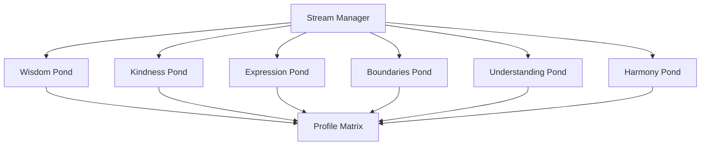
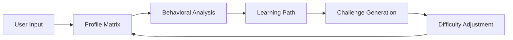
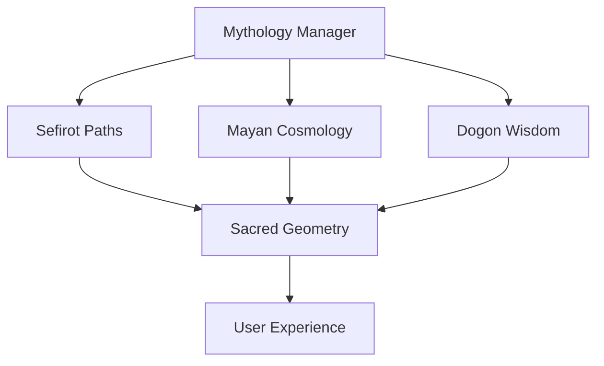

# Vortex of Enlightenment Architecture

## System Overview

The Vortex of Enlightenment is built on a modular architecture that combines mystical traditions with advanced behavioral analysis. This document outlines the core architectural components and their interactions.

## Core Components

### 1. Pond System


#### Key Components:
- **Stream Manager**: Central routing and state management
- **Pond Instances**: Independent realms with specific focuses
- **Profile Matrix**: Behavioral analysis and progress tracking

### 2. Profile System



#### Components:
- **Profile Matrix**: Multi-dimensional user state tracking
- **Behavioral Analysis**: Pattern recognition and user modeling
- **Learning Path**: Customized progression routes
- **Challenge Generation**: Dynamic content creation
- **Difficulty Adjustment**: Adaptive experience scaling

### 3. Mythology Integration



## Data Flow

### 1. User Interaction Flow
1. User input received through terminal interface
2. Stream Manager routes to appropriate pond
3. Pond processes interaction and updates Profile Matrix
4. Profile Matrix triggers learning path adjustments
5. New challenges generated based on updated profile

### 2. State Management
- **Session State**: Managed by Stream Manager
- **User State**: Stored in Profile Matrix
- **Pond State**: Individual pond instances
- **System State**: Global configuration and settings

## Technical Implementation

### Core Technologies
- Python 3.8+
- SQLAlchemy for data persistence
- Custom terminal UI framework
- Neural network for behavioral analysis

### Key Interfaces

#### 1. Base Zone Interface
```python
class BaseZone:
    def enter(self)
    def process_input(self, input_data)
    def get_state(self)
    def update_profile(self, profile_data)
```

#### 2. Profile Matrix Interface
```python
class ProfileMatrix:
    def update(self, behavioral_data)
    def get_profile(self)
    def analyze_patterns()
    def generate_path()
```

## Security and Data Privacy

### Data Protection
- User data encryption at rest
- Secure session management
- Privacy-focused profile storage

### System Security
- Input validation and sanitization
- Rate limiting and access controls
- Secure configuration management

## Performance Considerations

### Optimization Points
- Profile Matrix calculations
- Challenge generation algorithms
- Stream routing efficiency
- State management overhead

### Scalability
- Modular pond system
- Efficient data structures
- Optimized algorithms
- Resource management

## Development Guidelines

### Code Organization
- Modular architecture
- Clear separation of concerns
- Consistent interface patterns
- Comprehensive documentation

### Best Practices
- Type hints throughout
- Comprehensive testing
- Performance monitoring
- Security-first approach

## Future Considerations

### Planned Improvements
- Enhanced profile analysis
- Additional mystical traditions
- Advanced visualization
- Extended challenge systems

### Scalability Plans
- Distributed processing
- Enhanced data analytics
- Advanced pattern recognition
- Extended mythology integration

---

## Appendix

### Component Dependencies
- Profile Matrix → Stream Manager
- Stream Manager → Ponds
- Mythology Manager → Sacred Geometry
- Ponds → Challenge Generation

### System Requirements
- Python 3.8+
- 4GB RAM minimum
- SQLite/PostgreSQL
- Terminal with Unicode support 